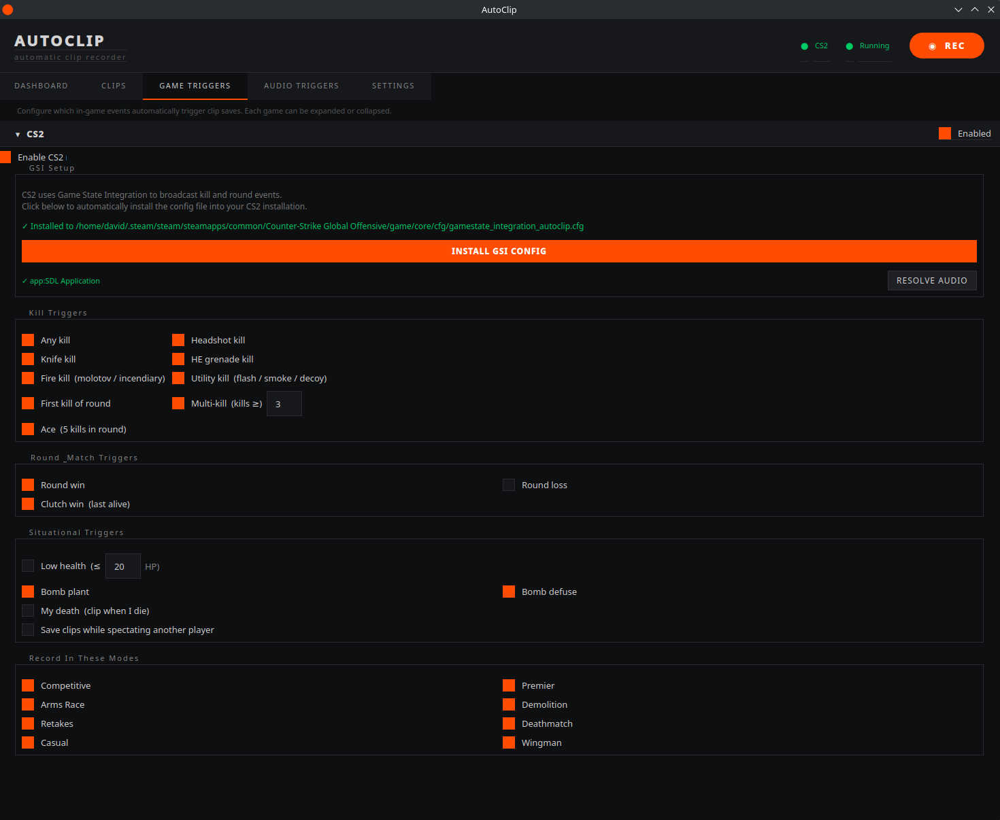
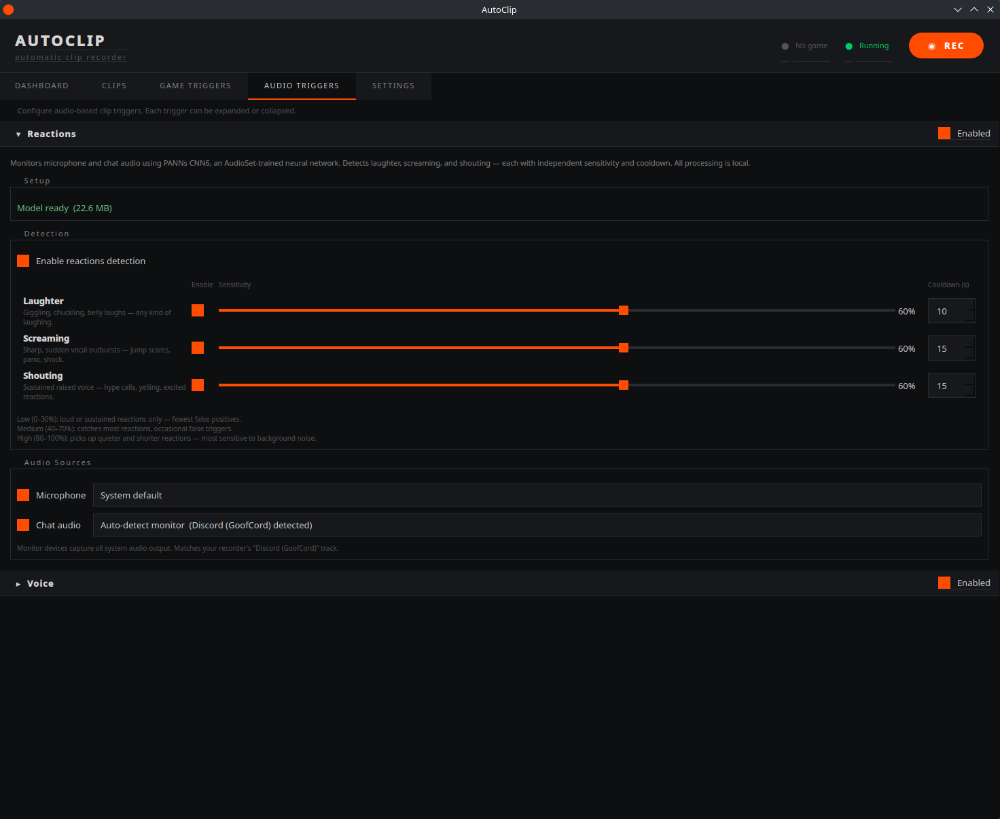

# AutoClip

Automatic game clip recorder for **Windows and Linux**. Monitors game events in real time and saves a replay-buffer clip the moment something clip-worthy happens — kills, clutches, vocal reactions, spoken phrases, or a manual hotkey. The recording backend is [gpu-screen-recorder](https://git.dec05eba.com/gpu-screen-recorder/about/) on Linux and a bundled [libobs](https://obsproject.com/) (the OBS capture engine) on Windows — same app, same clips, no separate setup on Windows.


> **Current game support: Counter-Strike 2 only.**
> AutoClip uses a plugin architecture — each game is a self-contained module. CS2 is the only built-in game plugin right now, but adding support for a new game is a single new file (and on a packaged build you can drop it into a plugins folder with no rebuild). Contributions welcome.

---

## Features

- **Automatic game triggers** — CS2 kills, headshots, multi-kills, clutches, and bomb events via Game State Integration (GSI). Zero anti-cheat risk — GSI is an official Valve feature.
- **Audio triggers** — two built-in triggers monitor your mic and chat audio simultaneously:
  - **Reactions** — detects laughter, screaming, and shouting via PANNs CNN6 (local ML inference). Each reaction type has independent sensitivity and cooldown settings.
  - **Phrases** — saves a clip when you say a configured phrase (e.g. "clip that"). Uses Vosk offline speech recognition — no cloud, no API key. The matched phrase is recorded in the clip filename.
  - New triggers can be added as single-file plugins.
- **Manual hotkey** — save a clip at any time with `Ctrl+Shift+S` (configurable).
- **Record without a game** — optionally keep the replay buffer running even when no game is detected, so audio triggers can save clips at any time (clips go to a `General/` folder).
- **Multi-track audio** — record game audio, mic, and chat as separate tracks; adjust per-track volume in the timeline; mix down on export. On **Windows** you can capture specific **applications** (e.g. the game and your chat app) as separate tracks, not just audio devices.
- **Encoding control (Windows)** — full NVENC controls (rate control CBR/VBR/CQP, quality/CQ, encoder preset, multipass, AV1) with one-click hardware-aware presets (Quality / Balanced / Performance / Storage saver).
- **Clip browser** — browse, preview, trim, and export clips with a built-in player. The timeline shows stacked per-track waveforms with labelled tracks, per-track volume dials, frame-step controls, and set-in/set-out buttons.
- **Clip metadata** — events, map, round, team, and score are encoded in the filename so clips are self-describing.
- **System tray** — minimize to tray, start minimized on boot, and a single-instance guard so only one copy runs.
- **One-click updates** — AutoClip checks GitHub for new releases and lets you install from **Settings → Updates**. It never updates on its own.
- **Extensible** — adding a new game or audio trigger is a single file, and packaged builds support drop-in plugin folders (no rebuild). See [Adding a new game](#adding-a-new-game).

---

<details>
<summary>Screenshots</summary>


*Clip browser — browse by game and date, preview thumbnails*


*Player with timeline scrubber, event markers, and per-track waveforms*


*Game Triggers — CS2 kill, round, and situational trigger configuration*


*Audio Triggers — Reactions (laughter, screaming, shouting) and Phrases trigger*


*Settings — recorder, audio tracks, encoding, and clip timing*

</details>

---

## Installation

### Windows

Download the latest **`AutoClip-Setup-<version>.exe`** from the [Releases page](https://github.com/SmoJa/autoclip/releases) and run it. It's a per-user install (no admin / UAC) to `%LOCALAPPDATA%\Programs\AutoClip`, and adds Start-menu (and optional desktop) shortcuts. Everything AutoClip needs — Python, the GUI, and the libobs recording engine — is bundled; there's nothing else to install.

> Requires Windows 10/11 (64-bit) and a GPU with hardware video encoding (NVIDIA NVENC, or an x264 CPU fallback).

### Linux

```bash
curl -s https://raw.githubusercontent.com/SmoJa/autoclip/main/install.sh | bash
```

This installs AutoClip to `~/.local/share/autoclip/`, installs Python dependencies, and adds an entry to your application menu. Then launch it from your application menu or run `~/.local/share/autoclip/autoclip/run.sh`.

Linux needs a few system packages:

| Package | Purpose |
|---------|---------|
| [gpu-screen-recorder](https://git.dec05eba.com/gpu-screen-recorder/about/) | Replay buffer recording |
| `mpv` / `libmpv` | In-app clip playback |
| `ffmpeg` | Thumbnails, export, clip probing |
| Python 3.10+ | Runtime |

Install `mpv` and `ffmpeg` via your distro's package manager. Install gpu-screen-recorder via your package manager or as a Flatpak (`flatpak install flathub com.dec05eba.gpu_screen_recorder`); the default expected path is `/usr/local/bin/gpu-screen-recorder` (configurable in **Settings → Recorder**).

> **Hotkey note (Linux):** the global hotkey needs your user in the `input` group — `sudo usermod -aG input $USER`, then log out and back in.

To enable autostart on login, use the toggle in **Settings → Application** (both platforms).

### Audio trigger models (optional, both platforms)

Both audio-trigger models download automatically the first time you enable them in Settings — no extra steps.

- **Reactions** — PANNs CNN6 (~25 MB ONNX), via **Settings → Audio Triggers → Reactions**.
- **Phrases** — Vosk small English model (~40 MB), via **Settings → Audio Triggers → Phrases**.

---

## First-time setup

1. **Settings → Audio Tracks** — pick your game audio source and optionally mic/chat tracks (on Windows you can select the game and chat **applications** directly).
2. **Game Triggers → CS2 → Install GSI Config** — writes the GSI config into your CS2 installation so CS2 broadcasts events to AutoClip. Restart CS2 afterwards.
3. *(Linux)* **Settings → Recorder** — verify the `gpu-screen-recorder` path and output directory.
4. Launch a game. AutoClip detects the process, starts the recorder, and begins saving clips on configured events.

---

## Updating

AutoClip checks GitHub for newer releases and surfaces them in **Settings → Updates** — it never updates silently.

- **Windows** — when an update is available, the Updates button becomes **Install**. Routine updates replace the app files in place (a small download); occasional updates that change the bundled runtime download a fresh installer. Either way it's one click.
- **Linux** — updates `git pull` the source install in place.

---

## How it works

```
CS2 (GSI HTTP) ──► cs2.py ──► controller.py ──► clip_trigger.py ──► recorder backend
                                    ▲                               (gpu-screen-recorder / libobs)
         reactions.py / phrases.py ─┘  (audio triggers, same pipeline)
```

- The recorder runs a **replay buffer** — the last N seconds of video/audio are held in RAM at near-zero CPU cost.
- When a trigger fires, AutoClip waits the configured post-event delay (default 7 s), then flushes the buffer to disk.
- The saved clip is renamed with full metadata encoded in the filename: map, mode, round, score, events with timestamps.

---

## Clip filename format

```
CS2_comp_de_dust2_r8_ct_14-12_ev[hs:7.0:awp,mk:5.0:awp]_2026-05-23_21-32-05.mp4
 │    │    │         │  │       └─ events: trigger:secs_before_end:weapon
 │    │    │         │  └─ score ct-t
 │    │    │         └─ round
 │    │    └─ map
 │    └─ mode
 └─ game
```

---

## Adding a new game

Create a class inheriting `GamePlugin` — set `NAME`, `PROCESS_NAMES`, trigger/mode vocabulary tables, and implement `start()` / `stop()`. The registry auto-discovers it on next launch. See `games/base.py` for the full interface and `games/cs2.py` as a reference.

Two places it can live:
- **In the source tree** — `autoclip/games/mygame.py` (shipped with the app).
- **Drop-in (no rebuild)** — drop the `.py` into the user plugins folder and restart:
  - Windows: `%APPDATA%\autoclip\plugins\games\`
  - Linux: `~/.config/autoclip/plugins/games/`

## Adding a new audio trigger

Same idea with `AudioTriggerPlugin` (set `NAME`, `TRIGGER_NAME`, implement `start()` / `stop()`; see `audio_triggers/reactions.py`). Drop-in folder is `…/autoclip/plugins/audio/`.

---

## File locations

| Purpose | Windows | Linux |
|---------|---------|-------|
| Settings | `%APPDATA%\autoclip\config.json` | `~/.config/autoclip/config.json` |
| Custom themes | `%APPDATA%\autoclip\themes\` | `~/.config/autoclip/themes/` |
| User plugins | `%APPDATA%\autoclip\plugins\` | `~/.config/autoclip/plugins/` |
| Clips (default) | `%USERPROFILE%\Videos\Autoclip\` | `~/Videos/Autoclip/` |
| Thumbnail / model cache | `%LOCALAPPDATA%\autoclip\` | `~/.cache/autoclip/` |
| Log | `%LOCALAPPDATA%\autoclip\autoclip.log` | `/tmp/autoclip.log` |

---

## Known limitations and untested areas

AutoClip is in early release; the Windows port is newer than the Linux build. Areas with rough edges:

- **Reactions and Phrases triggers** — functional but not extensively tested in real sessions; sensitivity/phrase-detection defaults may need tuning.
- **AMD and Intel GPUs** — codec/hardware detection is implemented but tested mainly on NVIDIA; on Windows non-NVIDIA falls back to x264 (CPU) encoding.
- **HDR recording** — the HDR path exists but is lightly tested.
- **Plugin architecture** — designed for extensibility but mostly exercised with the built-in plugins.
- **Linux desktops/distros** — developed on KDE Plasma / Nobara; other compositors and distros should work but autostart/launcher integration is less tested. AutoClip runs under XWayland (native Wayland not yet supported).

Contributions and bug reports are welcome.

---

<details>
<summary>Project layout</summary>

Shared cross-platform core, with thin platform-specific modules (`*_windows.py` / `*_linux.py`) selected at import time.

```
autoclip/
├── core/
│   ├── controller.py              # Orchestrates all components
│   ├── config.py                  # Settings (platform-aware paths)
│   ├── clip_trigger.py            # Accumulates events, fires save, renames clips
│   ├── recorder.py                # Shim -> recorder_{linux,windows}.py
│   ├── recorder_linux.py          # gpu-screen-recorder lifecycle
│   ├── recorder_windows.py        # libobs recorder lifecycle (spawns obs_recorder.py)
│   ├── obs_recorder.py            # Standalone libobs (ctypes) recorder process (Windows)
│   ├── audio.py                   # Shim -> audio_{linux,windows}.py
│   ├── hardware_detection.py      # Shim -> GPU/HDR detection, codec selection
│   ├── updater.py                 # Cross-platform self-update
│   ├── user_plugins.py            # Drop-in plugin loader
│   ├── clips.py / metadata.py / audio_mix.py / model_cache.py
├── games/         base.py · registry.py · cs2.py
├── audio_triggers/ base.py · registry.py · reactions.py · phrases.py
└── gui/           main_window.py · clips_tab.py · player.py · timeline.py · …
scripts/           build-obs-runtime.ps1 · build-src-zip.ps1 · export_audio_classifier.py
installer/         AutoClip.iss (Inno Setup, Windows)
```

</details>

---

## License

AutoClip is licensed under the [GNU General Public License v3.0](LICENSE).

The PANNs CNN6 model weights ([Kong et al.](https://arxiv.org/abs/1912.10211)) are MIT licensed.
