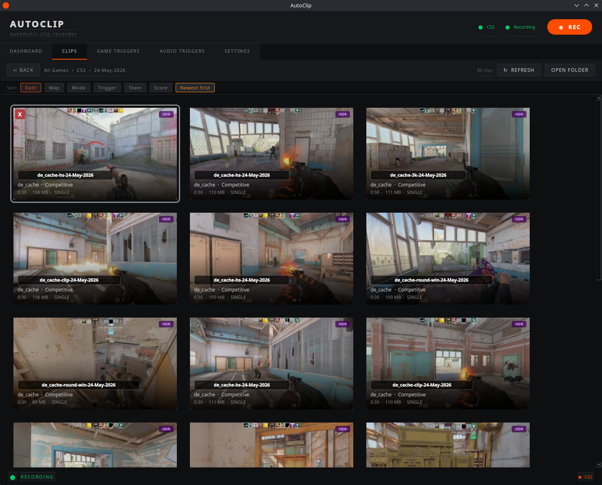
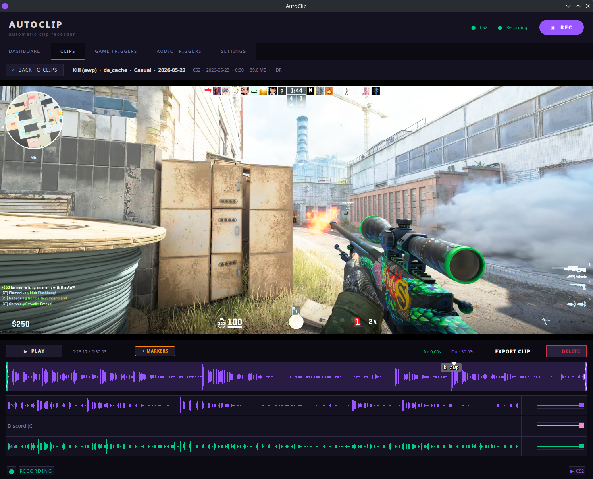
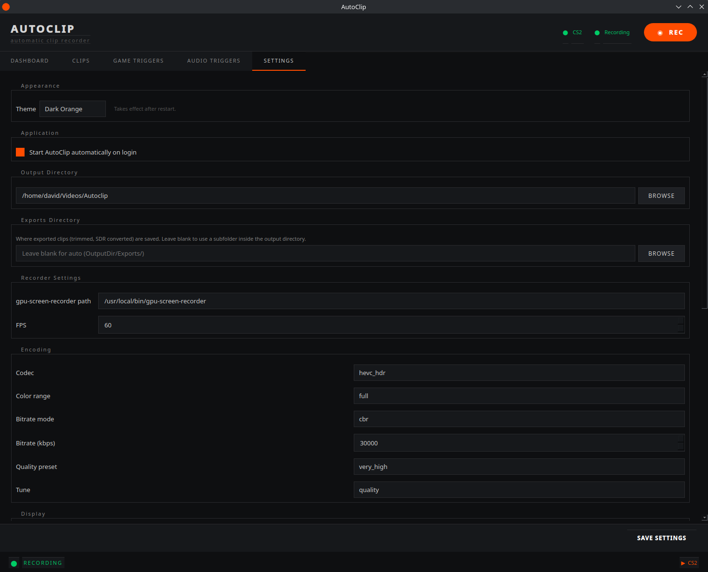

# AutoClip

Automatic game clip recorder for Linux. Monitors game events in real time and triggers [gpu-screen-recorder](https://git.dec05eba.com/gpu-screen-recorder/about/) to save a replay-buffer clip the moment something clip-worthy happens — kills, clutches, laughter, or a manual hotkey.


> **Current game support: Counter-Strike 2 only.**
> AutoClip uses a plugin architecture — each game is a self-contained module. CS2 is the only built-in game plugin right now, but adding support for a new game is a single new file. Contributions welcome.

---

## Features

- **Automatic game triggers** — CS2 kills, headshots, multi-kills, clutches, and bomb events via Game State Integration (GSI). Zero anti-cheat risk — GSI is an official Valve feature.
- **Audio triggers** — ML-based laughter detection (PANNs CNN6, local inference) monitors your mic and chat audio simultaneously. New audio triggers can be added as plugins.
- **Manual hotkey** — save a clip at any time with `Ctrl+Shift+S` (configurable).
- **Clip browser** — browse, preview, trim, and export clips with a built-in player, timeline scrubber, and per-track waveforms.
- **Multi-track audio** — record game audio, mic, and chat as separate tracks; mix down on export.
- **Clip metadata** — events, map, round, team, and score are encoded in the filename so clips are self-describing.
- **Extensible** — adding a new game or audio trigger is a single new file. See [Adding a new game](#adding-a-new-game) below.

---

## Screenshots


*Clip browser — browse by game and date, preview thumbnails*


*Player with timeline scrubber, event markers, and per-track waveforms*


*Settings — recorder, audio tracks, encoding, and clip timing*

---

## Requirements

### System packages

| Package | Purpose |
|---------|---------|
| [gpu-screen-recorder](https://git.dec05eba.com/gpu-screen-recorder/about/) | Replay buffer recording |
| `mpv` / `libmpv` | In-app clip playback |
| `ffmpeg` | Thumbnails, export, clip probing |
| Python 3.10+ | Runtime |

On Fedora / Nobara:
```bash
sudo dnf install mpv ffmpeg
```

Install via your distro's package manager, or as a Flatpak:
```bash
flatpak install flathub com.dec05eba.gpu_screen_recorder
```
See the [gpu-screen-recorder README](https://git.dec05eba.com/gpu-screen-recorder/about/) for other options. The default expected path is `/usr/local/bin/gpu-screen-recorder` (configurable in Settings → Recorder).

### Python dependencies

```bash
pip install -r autoclip/requirements.txt
```

| Package | Purpose |
|---------|---------|
| PyQt6 | GUI |
| python-mpv | mpv Python bindings |
| pynput | Global hotkey |
| sounddevice | Microphone/monitor capture for audio triggers |
| numpy | Audio processing |
| onnxruntime | ML inference for laughter detection |
| requests | GSI HTTP server |
| send2trash | Trash clips from the browser (optional, falls back to permanent delete) |

> **Hotkey note:** `pynput` requires your user to be in the `input` group:
> ```bash
> sudo usermod -aG input $USER
> # log out and back in
> ```

### Laughter detection model (optional)

Laughter detection requires a one-time model export (needs `torch` and `panns_inference`, download-only deps):

```bash
pip install torch panns_inference onnxruntime
python3 scripts/export_audio_classifier.py
```

This downloads ~14 MB of pretrained weights from Zenodo and exports them to `~/.cache/autoclip/models/panns_cnn6.onnx`. After that, `torch` and `panns_inference` can be uninstalled — only `onnxruntime` is needed at runtime.

---

## Installation

```bash
git clone https://github.com/SmoJa/autoclip.git
cd autoclip
pip install -r autoclip/requirements.txt
```

To add a desktop launcher and optional autostart-on-login, use the toggle in **Settings → Application** once AutoClip is running.

---

## Running

```bash
QT_QPA_PLATFORM=xcb python3 -m autoclip.main
```

Or use the included helper script (logs to `/tmp/autoclip.log`):

```bash
./autoclip/run.sh
```

> `QT_QPA_PLATFORM=xcb` forces XWayland rendering. This is required for the embedded mpv player to work correctly under Wayland compositors.

---

## First-time setup

1. **Settings → Recorder** — verify the `gpu-screen-recorder` path and output directory.
2. **Settings → Audio Tracks** — select your game audio source and optionally mic/chat tracks.
3. **Game Triggers → CS2 → Install GSI Config** — writes the GSI config into your CS2 installation so CS2 broadcasts events to AutoClip. Restart CS2 afterwards.
4. Launch a game. AutoClip detects the process, starts the recorder, and begins saving clips on configured events.

---

## How it works

```
CS2 (GSI HTTP) ──► cs2.py ──► controller.py ──► clip_trigger.py ──► gpu-screen-recorder
                                    ▲
                   laughter.py ─────┘  (audio trigger, same pipeline)
```

- gpu-screen-recorder runs a **replay buffer** — the last N seconds of video/audio are held in RAM at near-zero CPU cost.
- When a trigger fires, AutoClip waits the configured post-event delay (default 7 s), then signals gsr to flush the buffer to disk.
- The saved clip is renamed with full metadata encoded in the filename: map, mode, round, score, events with timestamps.

---

## Clip filename format

```
CS2_comp_de_dust2_r8_ct_14-12_ev[hs:7.0:awp,mk:5.0:awp]_2026-05-23_21-32-05.mkv
 │    │    │         │  │       └─ events: trigger:secs_before_end:weapon
 │    │    │         │  └─ score ct-t
 │    │    │         └─ round
 │    │    └─ map
 │    └─ mode
 └─ game
```

---

## Adding a new game

Create `autoclip/games/mygame.py` with a class inheriting `GamePlugin`. Set `NAME`, `PROCESS_NAMES`, trigger/mode vocabulary tables, and implement `start()` / `stop()`. The registry auto-discovers it on next launch — no other files need changing. See `games/base.py` for the full interface and `games/cs2.py` as a reference.

## Adding a new audio trigger

Create `autoclip/audio_triggers/myplugin.py` inheriting `AudioTriggerPlugin`. Set `NAME`, `TRIGGER_NAME`, and implement `start()` / `stop()`. See `audio_triggers/base.py` and `audio_triggers/laughter.py` as a reference.

---

## Project layout

```
autoclip/
├── main.py                        # Entry point
├── requirements.txt
├── core/
│   ├── controller.py              # Orchestrates all components
│   ├── config.py                  # Settings (persisted to ~/.config/autoclip/config.json)
│   ├── clip_trigger.py            # Accumulates events, fires save signal, renames clips
│   ├── recorder.py                # gpu-screen-recorder lifecycle
│   ├── clips.py                   # Clip scanning, probing, trim, export
│   ├── metadata.py                # Filename encoding/decoding
│   ├── audio.py                   # PipeWire device enumeration
│   ├── audio_mix.py               # Post-processing audio mix-down
│   ├── hardware_detection.py      # GPU/HDR detection, codec selection
│   └── model_cache.py             # Shared ONNX session cache
├── games/
│   ├── base.py                    # GamePlugin interface
│   ├── registry.py                # Auto-discovery
│   └── cs2.py                     # CS2 GSI integration
├── audio_triggers/
│   ├── base.py                    # AudioTriggerPlugin interface
│   ├── registry.py                # Auto-discovery
│   └── laughter.py                # PANNs CNN6 laughter detector
└── gui/
    ├── main_window.py             # Main window, Dashboard, Settings tabs
    ├── clips_tab.py               # Clip browser and player
    ├── player.py                  # Embedded mpv (OpenGL)
    ├── timeline.py                # Seek bar and event markers
    ├── track_waveforms.py         # Per-track waveform display
    ├── audio_tracks.py            # Audio track configuration widget
    ├── theme.py                   # Theme system
    └── widgets.py                 # Shared small widgets
scripts/
└── export_audio_classifier.py    # One-time PANNs CNN6 → ONNX export
```

---

## File locations

| Path | Purpose |
|------|---------|
| `~/.config/autoclip/config.json` | Settings |
| `~/.config/autoclip/themes/` | Custom themes |
| `~/Videos/Autoclip/` | Clips (default, configurable) |
| `~/.cache/autoclip/thumbs/` | Thumbnail cache |
| `~/.cache/autoclip/models/` | ML models |
| `/tmp/autoclip.log` | Log output |

---

## License

AutoClip is licensed under the [GNU General Public License v3.0](LICENSE).

The PANNs CNN6 model weights ([Kong et al.](https://arxiv.org/abs/1912.10211)) are MIT licensed.
